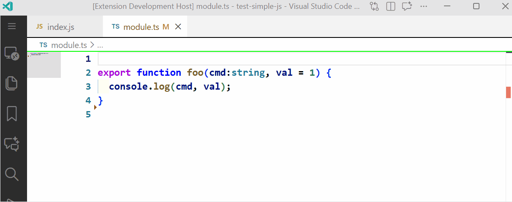

## Objectify Params

[](https://github.com/mark-hahn/vscode-objectify-params/actions/workflows/tests.yml)

Automatically refactor JavaScript or TypeScript functions to use object parameters instead of multiple positional parameters, improving readability and maintainability.

### Features

- **Automatic Refactoring**: Converts function signature and all call sites across your workspace
- **Smart Detection**: Identifies confirmed safe conversions and asks about uncertain cases
- **Preview Mode**: Optional preview dialogs to review each change before applying
- **Workspace-Wide**: Scans and updates all matching files in your project
- **Type-Safe**: Preserves TypeScript types, optional parameters, and function return types
- **Optional-Aware Calls**: Skips emitting `{ param: undefined }` when the original argument was optional or omitted, keeping converted calls tidy



*Preview walkthrough is optional.*

### Usage

1. Place your cursor inside a function definition.
2. Right-click and select **"Objectify Params"** or use the Command Palette. You can assign your own hot-key.
3. Review any uncertain conversions in interactive dialogs. In every dialog the cancel button will remove all changes.
4. The extension updates both the function signature and all call sites.

#### Before
```typescript
function createUser(name: string, age: number, email?: string) {
  return { name, age, email };
}

createUser("Alice", 30, "alice@example.com");
createUser("Bob", 25);
```

#### After
```typescript
function createUser({ name, age, email }: { name: string; age: number; email?: string }) {
  return { name, age, email };
}

createUser({ name: "Alice", age: 30, email: "alice@example.com" });
createUser({ name: "Bob", age: 25 });
```

### Configuration

Access settings via **File > Preferences > Settings** and search for "Objectify Params":

#### `objectifyParams.include`
- **Type**: `string`
- **Default**: `"**/*.ts **/*.js"`
- Space-separated glob patterns of files to scan

#### `objectifyParams.exclude`
- **Type**: `string`
- **Default**: `"**/node_modules/**"`
- Space-separated glob patterns to exclude
- Priority over includes

#### `objectifyParams.showPreviews`
- **Type**: `boolean`
- **Default**: `false`
- Show preview dialog for every call conversion (including confirmed safe calls)

#### `objectifyParams.highlightDelay`
- **Type**: `number`
- **Default**: `500`
- **Range**: 0-5000ms
- Duration to show preview highlights. Set to `0` to show only the dialog without delay

#### `objectifyParams.objectVariable`
- **Type**: `string`
- **Default**: `$par$`
- Provide a variable name for a single object parameter in the signature. The extension inserts `let { ... } = $par$;` as the first statement inside the function body. If this field is blank then the object is destructured inline in the parameter list.

#### `objectifyParams.preserveTypes`
- **Type**: `boolean`
- **Default**: `true`
- When disabled, any extracted TypeScript types are replaced with `any`, dropping type information for both the incoming object and the destructured properties.

### Sample Command Runs

The `Objectify Params` command (Command Palette → **Objectify Params**) always follows the same interactive flow, but the `objectVariable` and `preserveTypes` settings change the resulting signature. The snippets below use this starting point:

```typescript
function submitOrder(userId: string, retryCount = 0) {
  console.log(userId, retryCount);
}
```

1. **objectVariable set + preserveTypes true (defaults)**
   - Keep the shipped defaults: `objectifyParams.objectVariable = "$params"`, `preserveTypes = true`.
   - Signature keeps the single variable and the body receives a destructuring line:

```typescript
function submitOrder($params: { userId: string; retryCount?: number }) {
  let { userId, retryCount = 0 } = $params;
  console.log(userId, retryCount);
}
```

2. **objectVariable set + preserveTypes false**
   - Leave `objectVariable` set (e.g., "$params") and change `preserveTypes = false`.
   - Result:

```typescript
function submitOrder($params: any) {
  let { userId, retryCount = 0 } = $params;
  console.log(userId, retryCount);
}
```

3. **objectVariable blank + preserveTypes true**
   - Clear the `objectVariable` setting (leave it blank) and keep `preserveTypes = true`.
   - Destructuring happens inline:

```typescript
function submitOrder({ userId, retryCount = 0 }: { userId: string; retryCount?: number }) {
  console.log(userId, retryCount);
}
```

4. **objectVariable blank + preserveTypes false**
   - `objectVariable` blank, `preserveTypes = false`.
   - Result drops the extracted type to `any`:

```typescript
function submitOrder({ userId, retryCount = 0 }: any) {
  console.log(userId, retryCount);
}
```

Run the command once for each combination by toggling the settings, or pin the options in your workspace settings to keep a preferred style.

### How It Works

1. **Scanning**: Searches your workspace for all references to the function
2. **Classification**: Categorizes calls as:
   - **Confirmed**: Safe to convert automatically
   - **Fuzzy**: Requires user review (name collisions, argument mismatches, etc.)
   - **Incompatible**: Cannot convert (call/apply/bind, spread arguments)
3. **Interactive Review**: Shows dialogs for fuzzy cases where you choose Convert or Skip
4. **Application**: Updates function signature and all approved call sites
5. **Verification**: Highlights the updated function signature

### Supported File Types

- TypeScript (`.ts`, `.tsx`, `.mts`, `.cts`)
- JavaScript (`.js`, `.jsx`, `.mjs`, `.cjs`)
- Vue (`.vue`)
- Svelte (`.svelte`)

### Requirements

- VS Code 1.50.0 or higher
- Works with both JavaScript and TypeScript projects

### Known Limitations

- Cannot convert functions called with `.call()`, `.apply()`, or `.bind()`
- Cannot convert functions called with spread arguments (`...args`)
- Rest parameters must use tuple syntax for type preservation

### Tips

- **Show Previews**: Enable `showPreviews` to review every conversion step-by-step
- **Fast Mode**: Set `highlightDelay` to `0` for instant dialogs without preview delays
- **Selective Scanning**: Adjust `include` patterns to limit scope for faster processing
- **Undo Support**: All changes are applied through VS Code's undo system

### License

MIT

### Links

- [Visual Studio Marketplace](https://marketplace.visualstudio.com/items?itemName=eridien.objectify-params)
- [GitHub Repository](https://github.com/mark-hahn/vscode-objectify-params)
- Issues and pull requests welcome

### Author

Mark Hahn (eridien)
